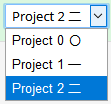
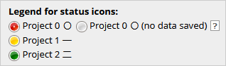
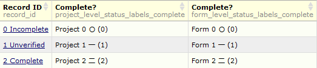

********************************************************************************
#Form Status Tweaks

Luke Stevens, Murdoch Children's Research Institute https://www.mcri.edu.au

********************************************************************************
## Summary of Functionality

Ever wanted to change the standard form status labels?
- Incomplete
- Unverified
- Complete
You'll have discovered you can't via a change to the language file or even via a manual database update to the form status fields' metadata.

Now you can!

### System Level Settings
Specify alternative text to be used in place of Incomplete/Unverified/Complete for all projects where the module is enabled.

## Project Level Settings
- Specify custom labels to be used in place of the system-level form status labels in the current project.
- Specify custom labels to be used in place of the system- or project-level form status labels for a specified instrument.

## Example
This example shows two forms, one showing forms status labels defined at project-level, the other for the individual form.
- Data entry form 
- Record Home page legend 
- Report view 

********************************************************************************